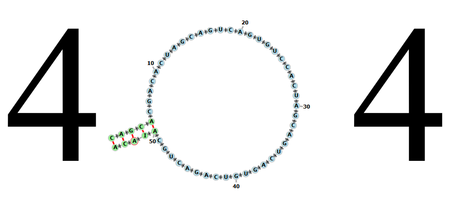

# 404ForRNAstructure

404.html for RNA structure; reduced pressure tool; just for fun :)

Implement it by fornac.js and fornac.css

***

You can drag that structure to get a decompression effect

Example:[exp](https://taolab.nwsuaf.edu.cn/404)
